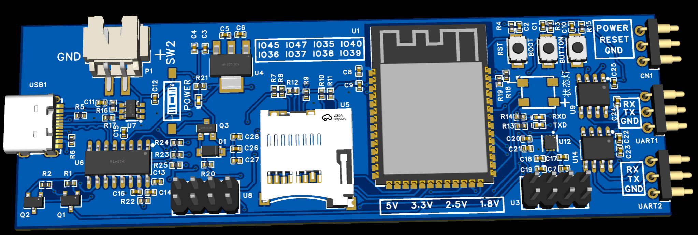
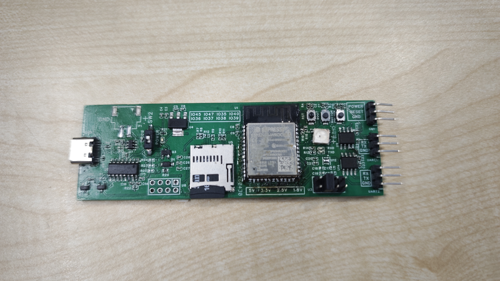

# ESP32-S3 Dual Mode UART Enhanced

[](LICENSE)
[](https://www.espressif.com/)
[](https://www.arduino.cc/)
[](doc/README.md)

安全加固的 ESP32-S3 双模式串口网关工程。项目将 UART、USB CDC、TCP 客户端、TCP 服务器、Web 管理页和 SD 日志整合到单一固件中，适合做串口设备联网、现场调试、数据采集网关和多终端透传。

## 项目亮点

- 单固件双模式：同一份代码可在客户端模式和服务器模式之间切换。
- 双串口通道：UART2 负责主透传链路，UART1 提供独立调试/采集通道。
- Web 管理界面：支持串口监视、日志查看、配置修改、客户端查看和电源控制。
- SD 卡日志：支持异步批量写入、按模式和通道分目录保存、可选时间戳。
- EEPROM 持久化：保存运行模式、波特率、客户端 ID 和 WiFi 配置。
- 安全加固：统一输入校验、帧格式检查、白名单过滤、错误计数、超时与来源封禁。

## 适用场景

- UART 设备远程联网透传
- 多终端接入的本地串口采集网关
- 带 Web 运维面的嵌入式串口服务器
- 需要本地日志落盘的现场调试设备

## 运行模式

| 模式 | 网络角色 | 默认网络行为 | 典型用途 |
| --- | --- | --- | --- |
| 客户端模式 | WiFi STA + TCP Client | 连接已配置 WiFi，向 192.168.1.1:8080 发起连接 | 设备主动接入上位机/网关 |
| 服务器模式 | WiFi SoftAP + TCP Server | 启动 AP，监听 8080，最多 5 个客户端 | 本地串口网关、现场调试热点 |

## 快速开始

### 1. 环境准备

- Arduino IDE 或 Arduino CLI
- ESP32 Arduino Core 3.3.8
- WiFiManager 2.0.17
- FastLED 3.10.3
- Windows PowerShell 5.1 或更高版本

### 2. 编译

```powershell
.\compile.ps1
```

说明：脚本会调用 Arduino CLI，并将产物输出到 build/esp32.esp32.esp32s3。

### 3. 烧录

```powershell
.\build_and_flash.ps1 -Port COM19
```

### 4. 首次启动建议

1. 上电后通过 USB 串口观察基础状态。
2. 如果处于客户端模式且未配置 WiFi，设备会自动进入配网模式。
3. 如果处于服务器模式，设备会启动 SoftAP、Web 页面和 TCP 服务。
4. 进入 Web 页面或发送 AT 指令完成参数调整。

## 文档导航

- [文档中心](doc/README.md)
- [硬件设计资料](doc/hardware/README.md)
- [系统架构](doc/architecture/README.md)
- [模块说明](doc/modules/README.md)
- [配置与接口](doc/configuration/README.md)
- [构建、烧录与运维](doc/operation/README.md)
- [安全设计](doc/security/README.md)

## 硬件设计资料

项目文档已补充硬件视图整理，包含原理图、PCB 图、3D 仿真图与实物图对应说明，适合在阅读代码、查看引脚定义和做结构装配时交叉对照。

| 3D 仿真图 | 实物图 |
| --- | --- |
|  |  |

- [硬件设计资料总览](doc/hardware/README.md)
- 重点包含 3D 仿真图与实物图的接口分布、按键位置、SD 卡槽与 UART 接口对照
- 原理图与 PCB 正反面图已同步收录在硬件设计资料页

## 仓库结构

```text
.
|-- dual-mode-uart-enhanced.ino   # 主入口、全局配置、setup/loop
|-- client_server_mode.ino        # 客户端/服务器模式状态机
|-- config_management.ino         # EEPROM、默认配置、按键切换
|-- uart_interrupt.ino            # UART1/UART2 DMA 与 TCP 发送缓冲
|-- uart_utility.ino              # USB AT 指令与本地串口透传入口
|-- web_server.ino                # Web 管理页面与 HTTP 路由
|-- battery_sd_management.ino     # 电池监测、SD 卡、日志落盘
|-- security_hardening.h/.ino     # 安全帧、白名单、超时与封禁
|-- compile.ps1                   # Arduino CLI 编译脚本
|-- build_and_flash.ps1           # 编译后烧录脚本
|-- PCB/                          # PCB 设计和 PDF 导出文件
`-- doc/                          # 详细工程文档（含硬件设计资料）
```

## 硬件摘要

| 功能 | 引脚 |
| --- | --- |
| UART2 RX/TX | GPIO16 / GPIO17 |
| UART1 RX/TX | GPIO19 / GPIO20 |
| RGB LED | GPIO48 |
| BOOT 按键 | GPIO0 |
| 配网触发 | GPIO42 |
| SD SPI | GPIO10 / GPIO11 / GPIO13 / GPIO12 |
| SD 电源控制 | GPIO8 |
| 电池 ADC | GPIO1 |
| 电源控制 / 复位控制 | GPIO5 / GPIO4 |

更完整的接线与配置说明见 [配置与接口](doc/configuration/README.md)、[硬件设计资料](doc/hardware/README.md) 和 [PCB 资料](PCB/dual-mode-uart-enhanced.pdf)。

## 当前实现边界

- 低功耗功能在代码中保留结构，但当前默认禁用。
- 透传安全帧实现的是语法和输入约束，不等同于加密认证链路。
- 客户端默认目标服务器 IP 仍为固定常量 192.168.1.1，适合与服务器模式配套使用。

## 参与贡献

欢迎通过 Issue 或 Pull Request 提交问题、修复和改进建议。建议先阅读 [系统架构](doc/architecture/README.md) 与 [模块说明](doc/modules/README.md)，再开始修改代码。

## 许可证

本项目使用 [GNU GPL v3](LICENSE) 许可证。