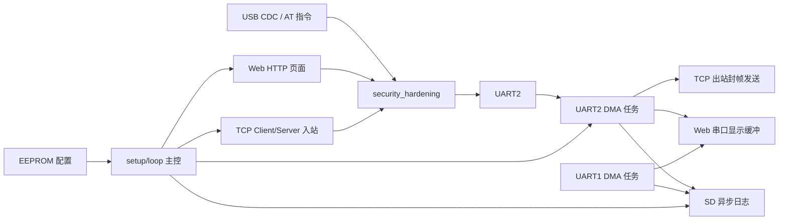

# 系统架构

本文档从工程视角说明该固件的整体组织方式、运行时主流程、核心数据链路和任务划分，便于理解“为什么代码会这样拆”。

## 1. 系统定位

该工程是一个基于 ESP32-S3 的串口网关固件，目标是在单固件中同时提供以下能力：

- UART2 主透传链路
- UART1 独立采集/调试链路
- USB CDC 本地管理入口
- TCP 客户端模式与 TCP 服务器模式
- Web 管理界面
- SD 卡日志落盘
- EEPROM 持久化配置
- 输入安全校验与攻击缓解

## 2. 顶层组成

## 3. 启动流程

启动入口位于 dual-mode-uart-enhanced.ino 的 setup()，核心顺序如下：

1. 关闭底层 WiFi 噪声日志，保证默认串口输出尽量干净。
2. 初始化 USB 串口。
3. 初始化 EEPROM，并加载运行模式、波特率、客户端 ID、WiFi 配置等持久化参数。
4. 预留安全缓冲区并清空各输入源安全状态。
5. 初始化 UART2 DMA 接收任务和 UART1 DMA 接收任务。
6. 初始化 LED、按键、电源控制引脚、SD 卡与电池监测。
7. 根据 currentMode 进入客户端模式或服务器模式初始化。
8. 启动 Web 服务。

这种顺序体现了一个原则：先恢复配置和通信能力，再启动上层服务与外部入口。

## 4. 主循环职责

loop() 不直接承担重 I/O 读写，而是做调度和状态维护：

- 刷新安全输入超时
- 处理 WiFiManager 非阻塞配网
- 处理按键事件
- 定时检测电池与 SD 卡状态
- 处理 USB CDC 串口入口
- 刷新 UART2 到 TCP/Web 的发送缓冲
- 处理 Web 请求
- 执行客户端或服务器模式状态机
- 批量落 SD 日志
- 更新 LED 状态

因此主循环更接近“协调器”，高吞吐的串口收发被卸载到 UART DMA 任务中。

## 5. 数据链路

### 5.1 USB CDC -> UART2 / TCP

USB 口既承担本地 AT 命令，也承担透传数据入口：

- 以 AT+ 前缀识别管理命令
- 非管理命令数据进入 security_hardening
- 校验通过后写入 UART2
- 若处于服务器模式并已选定客户端，可进一步进入 TCP 出站缓冲

### 5.2 TCP 入站 -> UART2

客户端模式和服务器模式都复用统一的安全解析流程：

- 先按来源写入独立帧缓冲区
- 校验帧头、帧尾、长度字段和负载长度
- 校验负载字符、白名单和危险指令
- 通过后写 UART2，同时写入 Web 缓冲和 SD 日志

### 5.3 UART2 DMA -> USB / Web / TCP / SD

UART2 接收使用 DMA 任务读取原始数据：

- 原始字节直接写回 USB 串口，保证终端兼容性
- 过滤 ANSI 后写入 Web 显示缓冲区
- 原始数据进入 TCP 发送缓冲，并按安全负载长度切片后重新封帧发送
- 客户端模式下将过滤后的逐行内容写入 SD 异步队列

### 5.4 UART1 DMA -> Web / SD

UART1 是独立通道：

- 不参与主透传安全帧链路
- 主要用于独立采集/调试
- 过滤 ANSI 后进入专属 Web 缓冲和专属日志目录

## 6. 并发模型

运行时主要有三类执行上下文：

- 主循环：状态机、Web、配置、调度
- uartRxTask：UART2 DMA 接收任务
- uartRxTask1：UART1 DMA 接收任务

关键共享资源的保护方式：

- TCP 发送缓冲使用临界区保护
- Web 显示缓冲使用独立的 portMUX_TYPE
- 安全状态按输入源分离，避免不同入口相互污染

## 7. 状态与持久化

系统状态分三层：

- 易失运行态：wifiConnected、tcpConnected、selectedClientIndex、LEDState
- 输入安全态：按 USB、Web、TCP Client、TCP Server 分别维护失败计数和超时
- 持久化配置：EEPROM 中的模式、波特率、日志时间戳、客户端 ID、WiFi 凭据

EEPROM 的设计目标不是高频写入，而是保存“跨重启仍然应生效”的配置。

## 8. 模式差异

### 客户端模式

- 设备作为 STA 连接外部 WiFi
- 建立到固定 server_ip:server_port 的 TCP 连接
- 若 WiFi 未配置，则自动进入配网模式
- 掉线后执行限次重连与异常恢复

### 服务器模式

- 设备启动 SoftAP
- 启动 TCP Server 和 Web Server
- 最多维护 5 个远程客户端
- 支持选择单个客户端做定向透明转发

## 9. 当前设计取舍

- 代码采用 Arduino 多 .ino 拼接方式，入口统一、上手快，但大型重构时要注意全局符号污染。
- 大量使用 String，开发效率高，但嵌入式长期运行时仍需关注碎片化风险。
- 低功耗逻辑已保留注释和状态位，但当前默认禁用，不属于主链路能力。
- 安全层负责“输入合法性”和“异常抑制”，不提供 TLS、鉴权或消息签名。

## 10. 建议阅读下一篇

继续阅读 [模块说明](../modules/README.md)，可以快速建立文件级别的认知地图。