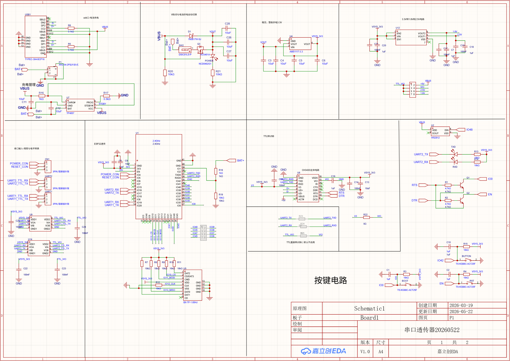
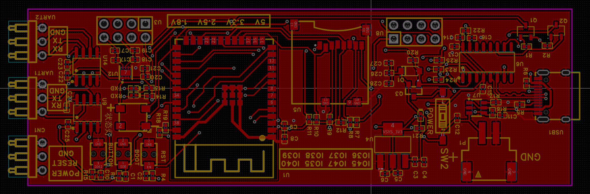
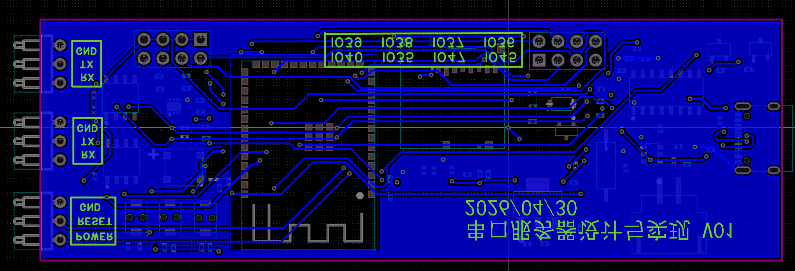

# 硬件设计资料

本文档整理本项目的原理图、PCB 图、3D 仿真图和实物图观察要点，帮助把固件中的引脚定义、接口分布和实际板卡结构对应起来。

## 1. 资料入口

| 资料 | 作用 | 仓库位置 |
| --- | --- | --- |
| 原理图 / PDF 导出 | 查看电源、USB、UART、SD、按键与 ESP32-S3 的电气连接 | [PCB/dual-mode-uart-enhanced.pdf](../../PCB/dual-mode-uart-enhanced.pdf) |
| PCB 原始工程 | 查看走线、封装、板框与布局细节 | [PCB/dual-mode-uart-enhanced_v0.8.dsn](../../PCB/dual-mode-uart-enhanced_v0.8.dsn) |
| 硬件接口说明 | 对照固件中的引脚、默认功能与运行时配置 | [配置与接口](../configuration/README.md) |

## 2. 图示总览

当前仓库已经同步收录硬件相关截图，位于 [doc/picture](../picture)。建议先浏览下面这组图，再结合原理图 PDF 与引脚文档阅读。

### 2.1 原理图截图

### 2.2 PCB 顶层布局

### 2.3 PCB 底层布局

### 2.4 3D 仿真图

### 2.5 实物图

## 3. 原理图解读

上面的原理图截图可以直接看到整板的供电、主控、USB 转串口、双 UART、SD 卡和按键电路分布，适合快速建立电气连接的全局认知。

从原理图可以把整板分成几块功能区域：

- 电源与充电区域：左上和上方区域包含 USB 供电、锂电池输入、充电管理、电压转换和 3.3V / 1.8V 电源轨。
- ESP32-S3 主控区域：中部是核心控制单元，负责双 UART、WiFi、Web、SD 与按键逻辑。
- UART 接口区域：右侧把 UART1、UART2 以及电平相关接口引出，便于外接串口设备。
- 存储与控制区域：下方包含 SD 卡、电源控制、复位和按键电路，对应代码中的日志、上电控制与模式切换逻辑。

阅读原理图时，建议优先对照以下固件功能：

- USB CDC 与串口管理：见 [uart_utility.ino](../../uart_utility.ino)
- UART DMA 与透传链路：见 [uart_interrupt.ino](../../uart_interrupt.ino)
- SD 日志与电池监测：见 [battery_sd_management.ino](../../battery_sd_management.ino)
- 运行时引脚定义：见 [配置与接口](../configuration/README.md)

## 4. PCB 布局说明

PCB 顶层图更适合观察器件分区和对外接口位置，底层图更适合观察长距离走线、电源回路与串口接口的引出方式。

PCB 版图反映了整板的实际功能分区，当前布局特点比较明确：

- 左侧为 USB-C 接口、电源和充电相关电路，便于上电、烧录和桌面调试。
- 中部为 SD 卡槽和 ESP32-S3 模组，是整板的核心区域。
- 右侧集中放置按键、状态灯以及 UART1 / UART2 排针，方便接线与人工操作。
- 板边丝印已经标出 UART、RESET、POWER、BOOT 等关键位置，便于现场接线和维护。

该布局与固件中的职责划分是对应的：左侧偏供电，中部偏主控与存储，右侧偏对外交互接口。

## 5. 3D 仿真图观察重点

3D 仿真图已经同步到本文档上方，可直接用来核对接口朝向与器件高度关系。

3D 仿真图适合用来确认器件遮挡、装配空间和接口朝向。结合当前设计，可以重点关注：

- USB-C 位于板左侧边缘，便于壳体开孔与调试线缆插拔。
- SD 卡槽位于中部偏左，插拔方向与板长边一致，适合做侧边或顶部检修口。
- ESP32-S3 模组位于中右区域，天线区应尽量避开金属遮挡和壳体贴近结构。
- 右侧顶部是按键区，右侧边缘是 UART1 / UART2 接口排针，适合做外部接插件出口。
- 底部的电平选择区域标有 5V、3.3V、2.5V、1.8V，适合在装配前完成目标串口电平配置。

3D 视图的主要价值是提前判断结构可制造性，而不是替代原理图或 PCB 检查。

## 6. 实物图观察重点

实物图已经同步到本文档上方，可直接和 3D 仿真图、PCB 顶层布局做一一对照。

实物板与 3D 仿真图的功能分布基本一致，适合用于现场调试和交付说明：

- 左侧可以直接看到 USB-C 接口，说明上电与调试入口集中在同一侧。
- 板中部可见 SD 卡槽，方便确认日志存储介质的安装方向。
- 中右位置为 ESP32-S3 模组，本体周围留出了按键和接口区。
- 右侧两组排针分别承担 UART1、UART2 接口引出，丝印已经标出 RX、TX、GND。
- 顶部按键区可以对应到 RESET、BOOT 和电源控制相关操作，便于和固件行为联调。

如果用于交付文档，建议把实物图和 [配置与接口](../configuration/README.md) 中的引脚表一起阅读，这样最容易建立“丝印位置 - 引脚功能 - 固件逻辑”的对应关系。

## 7. 阅读建议

推荐按下面顺序结合阅读：

1. 先看 [配置与接口](../configuration/README.md)，明确每个 GPIO 的用途。
2. 再看 [PCB PDF](../../PCB/dual-mode-uart-enhanced.pdf)，确认接口、电源和控制路径。
3. 然后对照 3D 仿真图和实物图确认结构位置、按钮和排针朝向。
4. 最后回到 [系统架构](../architecture/README.md) 和 [模块说明](../modules/README.md)，理解软件如何驱动这些硬件资源。