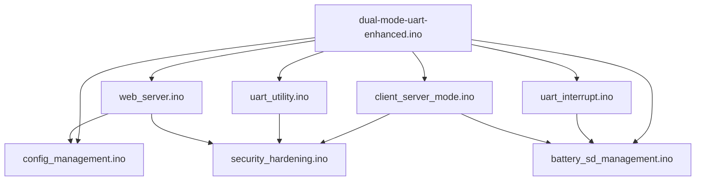

# 模块说明

本文档从文件粒度说明每个模块的职责、关键入口函数以及与其他模块的协作关系，便于快速定位改动点。

## 1. 文件职责总表

| 文件 | 主要职责 | 关键函数/对象 | 依赖关系 |
| --- | --- | --- | --- |
| dual-mode-uart-enhanced.ino | 主入口、全局配置、setup/loop 调度 | setup(), loop(), 全局宏/变量 | 所有模块共享的配置与状态中心 |
| client_server_mode.ino | 客户端/服务器模式初始化、WiFi 配网、重连与 TCP 入站处理 | initClientMode(), runClientMode(), initServerMode(), runServerMode() | 依赖 security_hardening、EEPROM 配置、Web/SD 记录 |
| config_management.ino | EEPROM 读写、默认配置生成、按键切换模式 | loadConfigFromEEPROM(), saveConfigToEEPROM(), switchMode(), resetToDefault() | 依赖 EEPROM 和全局配置常量 |
| uart_utility.ino | USB CDC 入口、AT 命令解析、本地透传分流 | handleUSBSerial(), handleCommand(), printHelp() | 依赖 security_hardening、UART DMA、配置管理 |
| uart_interrupt.ino | UART1/UART2 DMA 接收任务、TCP 发送缓冲、客户端选择 | initUARTInterrupt(), initUART1Interrupt(), flushTCPBuffer(), selectClient() | 依赖 UART 驱动、Web 缓冲、SD 日志 |
| web_server.ino | HTTP 路由、Web 页面、Web 配置和串口页面 | handleWebServer(), handleRootPage(), handleConfigPage(), handleSerialPage() | 依赖配置管理、安全层、SD、网络状态 |
| battery_sd_management.ino | 电池检测、SD 卡热插拔、日志目录和异步落盘 | checkBattery(), initSDCard(), enqueueSDLog(), processSDWriteQueue() | 依赖 SD、SPI、LED、模式状态 |
| security_hardening.h | 安全常量、类型声明、接口定义 | SecurityState, SecurityInputSource | 被多个 .ino 共享 |
| security_hardening.ino | 安全帧封装/解析、白名单、超时、封禁 | buildSecureFrame(), appendIngressChunk(), getValidatedPayload() | 被 USB/Web/TCP 入口统一调用 |
| compile.ps1 | Arduino CLI 编译 | compile 命令封装 | 本地构建 |
| build_and_flash.ps1 | 烧录脚本 | esptool 调用 | 交付与现场运维 |

## 2. 关键全局状态

以下全局状态由多个模块共享，修改前应先确认影响面：

| 状态 | 含义 | 主要读写模块 |
| --- | --- | --- |
| currentMode | 当前工作模式 | dual-mode-uart-enhanced, config_management, client_server_mode |
| wifiConnected | WiFi/SoftAP 是否可用 | client_server_mode, web_server, uart_utility |
| tcpConnected | TCP 客户端连接状态 | client_server_mode, uart_interrupt, uart_utility |
| selectedClientIndex | 服务器模式下的定向透传目标 | uart_interrupt, uart_utility, client_server_mode |
| client_id | 客户端标识符 | config_management, client_server_mode, battery_sd_management |
| logToSD / logWithTimestamp | SD 日志开关与时间戳策略 | battery_sd_management, uart_utility, web_server |
| debugMode | 调试输出开关 | 几乎所有模块 |

## 3. 主要调用关系

## 4. 典型改动应该落在哪个模块

### 修改网络角色或连接策略

优先看 client_server_mode.ino：

- 客户端重连策略
- 服务器接入数控制
- 配网进入/退出逻辑
- TCP 入站转 UART2 的行为

### 修改 EEPROM 参数或默认值

优先看 config_management.ino：

- 默认 WiFi 名称/密码生成逻辑
- EEPROM 地址布局
- 配置合法性校验
- 重置为默认值行为

### 修改 AT 指令

优先看 uart_utility.ino：

- 新增指令分支
- 修改帮助文本
- 本地 USB 串口命令与透传分流逻辑

### 修改串口吞吐或 DMA 行为

优先看 uart_interrupt.ino：

- DMA 缓冲区大小
- TCP 发送批处理
- UART1/UART2 的接收任务
- 选定客户端透传逻辑

### 修改 Web 页面或接口

优先看 web_server.ino：

- HTTP 路由
- 配置页字段
- 串口页的发送和拉取接口
- 日志浏览与下载

### 修改安全策略

优先看 security_hardening.ino：

- 安全帧格式
- 白名单和黑名单
- 错误计数与锁定阈值
- 超时策略和来源隔离

## 5. 低耦合修改建议

- 新增配置项时：先加 dual-mode-uart-enhanced.ino 的全局定义，再接 config_management.ino 的读写，最后补 Web/AT 入口。
- 新增网络命令时：优先复用 security_hardening 的统一帧逻辑，不要在单一路径做旁路直写。
- 新增日志来源时：优先复用 enqueueSDLog()，不要直接散落 File 写操作。
- 修改 Web 显示缓冲时：注意 UART1 和 UART2 缓冲是分离的，不要混写。

## 6. 扩展优先级建议

如果后续准备继续演进，推荐按以下顺序重构：

1. 把固定 server_ip 迁移为可配置项
2. 将 AT 指令解析从大 if/else 拆成命令表
3. 减少长生命周期 String 的堆分配
4. 将 Web 页面模板从 String 拼接拆成更可维护的片段
5. 如果需要安全认证，再在安全帧之上增加鉴权层

## 7. 建议阅读下一篇

继续阅读 [配置与接口](../configuration/README.md)，可快速了解引脚、EEPROM 和对外指令面。